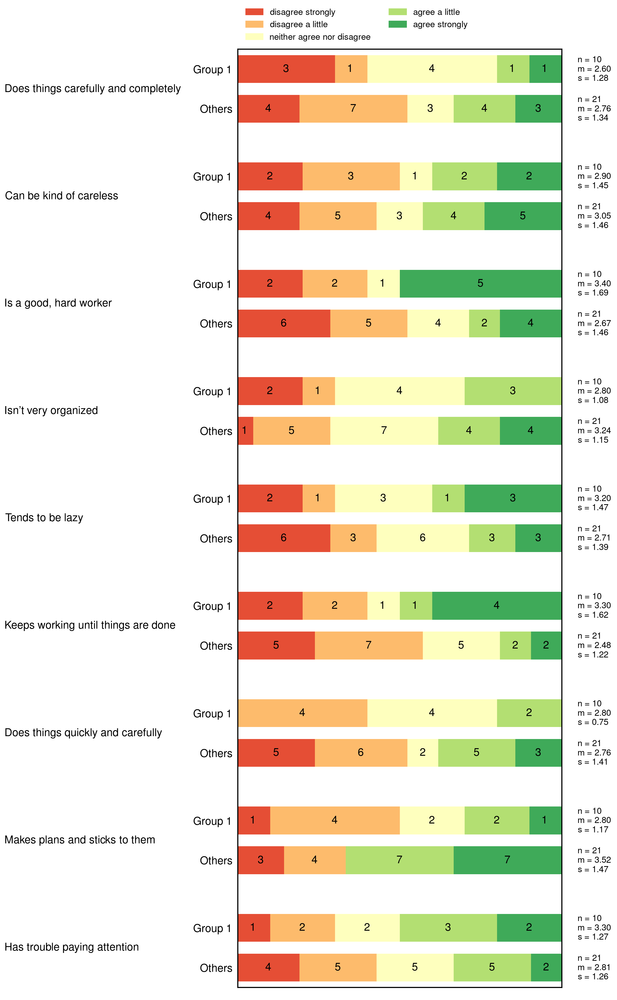
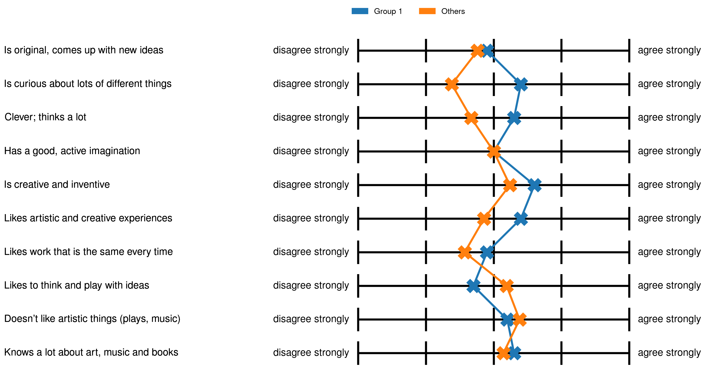
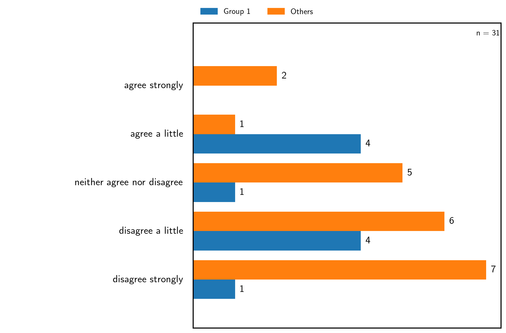
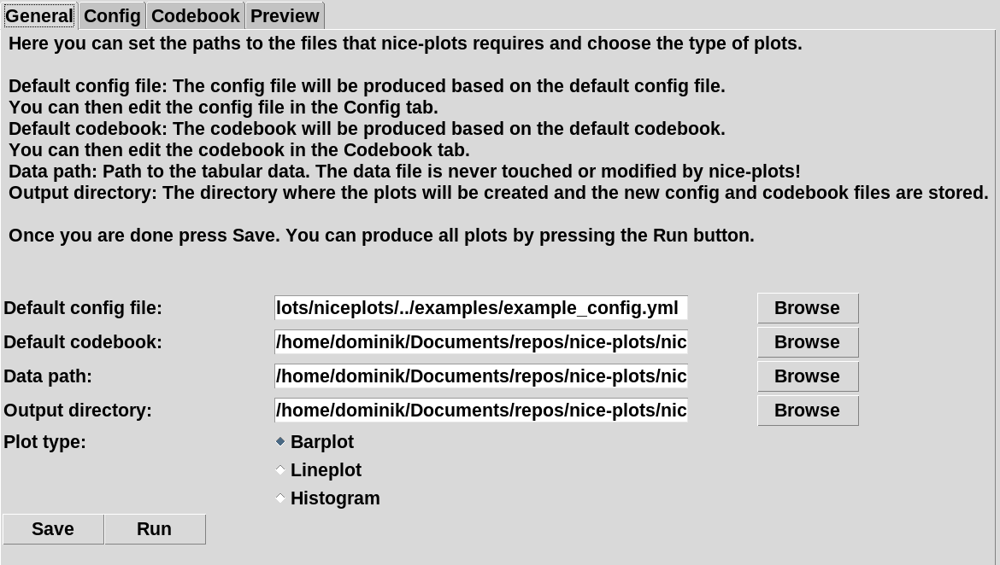
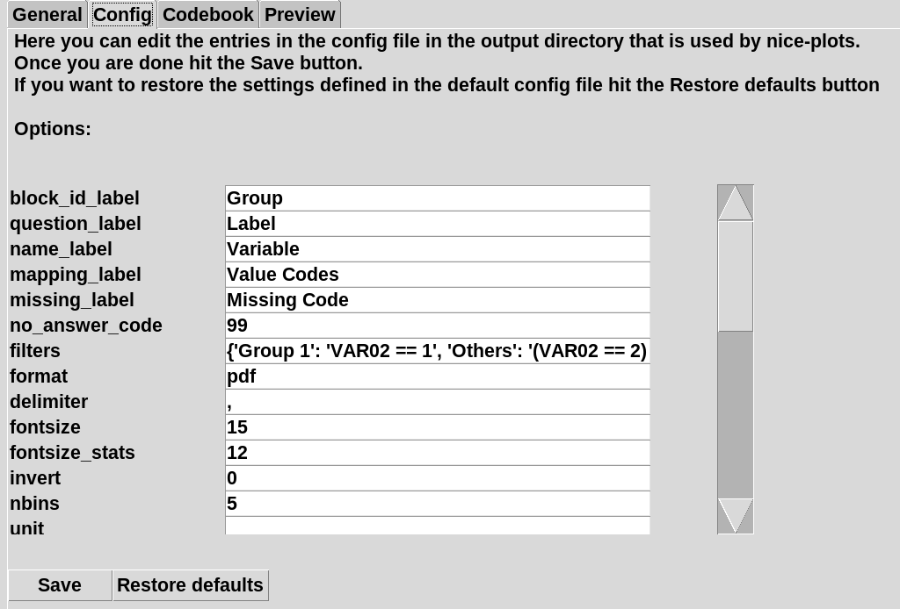
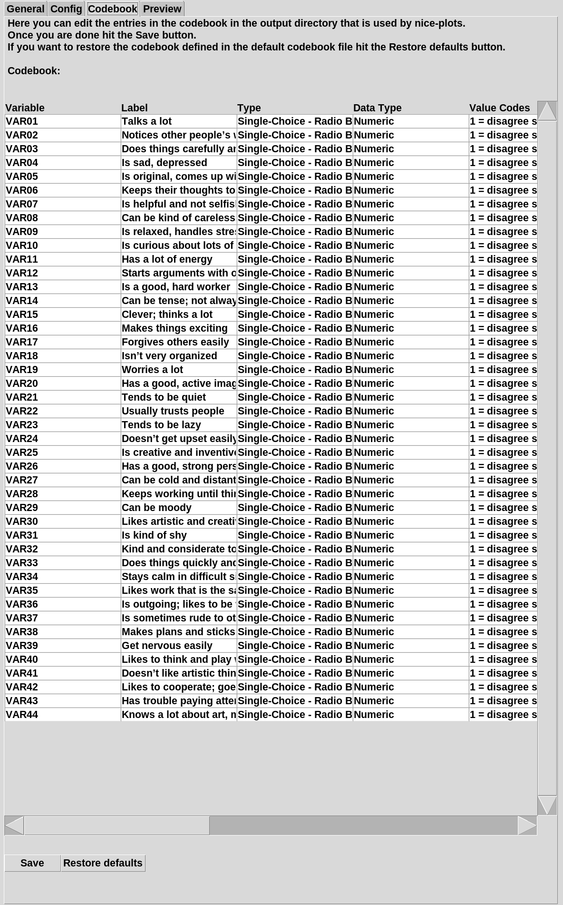
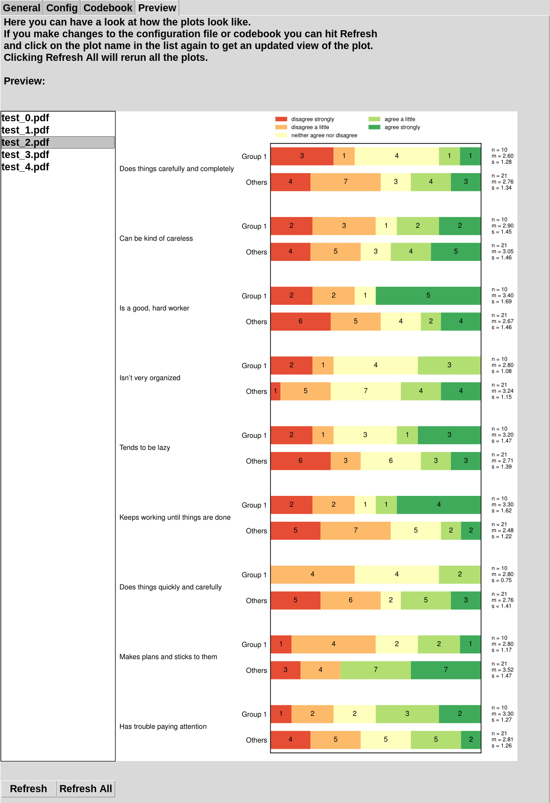

==========
nice-plots
==========

Introduction
============

nice-plots allows to easily and automatically visualize survey data.
Currently there are 3 different types of visualization:

barplot:
--------

lineplot:
---------

histogram:
----------

Installation
============

Open a terminal and clone the nice-plots repository:

    $ git clone https://github.com/DZuercher/nice-plots.git

Enter the nice-plots directory:

    $ cd nice-plots

Install nice-plots:

    $ pip3 install . --user

Depending on your operating system you might need to add the nice-plots
executable to the system PATH!
(There will be a warning in the pip log if that's the case)

Usage
=====

nice-plots is most easily used with the terminal.
Just run

    $ nice-plots --help

to get a list of the arguments that nice-plots accepts.
nice-plots requires a YAML config file, a codebook and a data table.

There is an example configuration file in the examples directory explaining the
different keywords that nice-plots accepts.

The plot_type keyword allows you to switch between different types of
visualization.

The output_name keyword specifies how the output directory will be called.

nice-plots copies the codebook and config file to the output directory and will
use these instead of the one provided with --config_path and --codebook_path
whenever you rerun nice-plots with the same output_name.

For a quick test of nice-plots navigate over to the examples directory and
run:

    $ nice-plots --config_path=example_config.yml --codebook_path=example_codebook.csv --data_path=example_data.csv --output_name=output1 --plot_type=bars

Graphical user interface:
=========================

nice-plots also features a small GUI for those that do not like the command line so much. The GUI is only supported for Linux systems at the moment.

General tab:
--------

Configuration tab:
--------

Codebook tab:
--------

Preview tab:
--------

Credits
=======

Main developer: Dominik Zuercher, dominikzuercher1999@gmail.com
Co-Developer: Valeria Glauser

You are free to use and modify nice-plots however you wish but we would be
glad if you cite this repository in your work.
